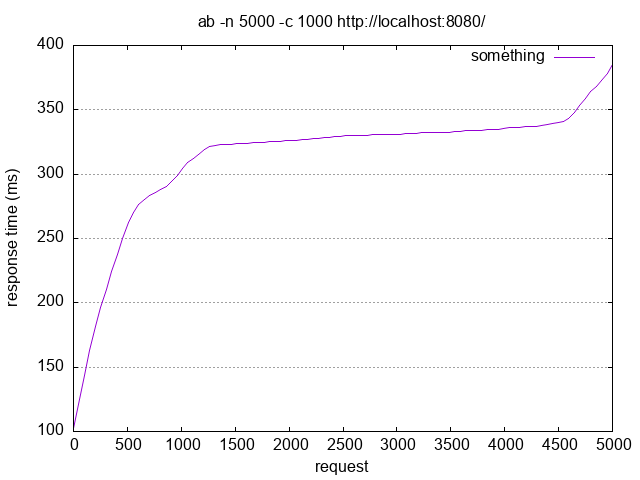

## Нагрузочное тестрирование через Apache Bench

В качестве тестовых бекендов использовались 2 представленных в директории .\test backends. Тестовые бекенды были развёрнуты локально (на портах :8081 и :8082), как и load balancer (порт :8080). 

Команда для тестирования `apache benchmark>ab -n 5000 -c 1000 -g out.data http://localhost:8080/`

## Результат команды
``` 
This is ApacheBench, Version 2.3 <$Revision: 1923142 $>
Copyright 1996 Adam Twiss, Zeus Technology Ltd, http://www.zeustech.net/
Licensed to The Apache Software Foundation, http://www.apache.org/

Benchmarking localhost (be patient)
Completed 500 requests
Completed 1000 requests
Completed 1500 requests
Completed 2000 requests
Completed 2500 requests
Completed 3000 requests
Completed 3500 requests
Completed 4000 requests
Completed 4500 requests
Completed 5000 requests
Finished 5000 requests


Server Software:
Server Hostname:        localhost
Server Port:            8080

Document Path:          /
Document Length:        33 bytes

Concurrency Level:      1000
Time taken for tests:   1.747 seconds
Complete requests:      5000
Failed requests:        0
Total transferred:      750000 bytes
HTML transferred:       165000 bytes
Requests per second:    2862.54 [#/sec] (mean)
Time per request:       349.340 [ms] (mean)
Time per request:       0.349 [ms] (mean, across all concurrent requests)
Transfer rate:          419.32 [Kbytes/sec] received

Connection Times (ms)
              min  mean[+/-sd] median   max
Connect:        0    0   0.3      0       1
Processing:   102  314  47.3    329     385
Waiting:        4  167  93.7    166     380
Total:        102  314  47.3    329     385

Percentage of the requests served within a certain time (ms)
  50%    329
    66%    332
  75%    334
  80%    336
  90%    340
  95%    359
  98%    373
  99%    378
 100%    385 (longest request)
 ```
 По выходным данным (файл out.data) был построен график с использованием gnuplot
 
